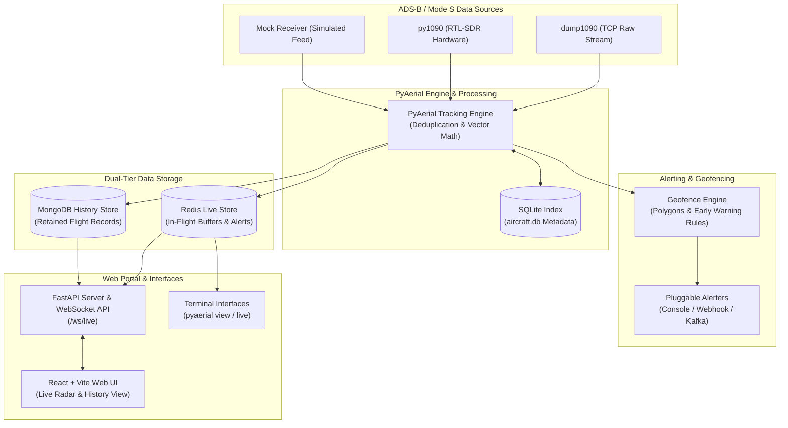

# PyAerial

_Scanning software for ADS-B / Mode S for AERPAW_

[](https://python.org)
[](https://opensource.org/licenses/MIT)
[](pyproject.toml)

**PyAerial** is a high-performance Python 3 application designed to receive ADS-B / Mode S aircraft telemetry signals, track flight positions in real time, evaluate dynamic polygon geofences with early-warning rules, trigger multi-channel alerts, stream live data to a web portal, and persist completed flights to a database.

---

## Architecture Overview



---

## Features

- Decodes position, altitude, horizontal/vertical velocity, direction, callsign, and ICAO plane categories in real time via [`pyModeS`](https://github.com/junzis/pymodes).
- Concurrently stream from TCP raw inputs (e.g. `dump1090`), direct hardware SDRs (`py1090` via `pyrtlsdr`), or synthetic test feeds (`mock`).
- Define custom polygon zones with rule constraints (`altitude`, `speed` / `horizontal_speed`, `heading` / `direction`, `distance`, `proximity`, `eta`) and lifecycle event hooks (`on_activate`, `on_deactivate`, `while_active`).
- Out-of-the-box support for console output (`print`), HTTP POST (`webhook`), and Apache Kafka message topics (`kafka`).
- Two storage methods:
  - Redis: live flight telemetry, active states, and real-time alert events (`live:flight:{id}`, `live:telemetry:{id}`, `live:alerts:{id}`, `live:active_alerts`, `live:alert_episodes`).
  - MongoDB: Persistent historical storage for important completed flights, track points, and alert episodes.
- Offline resolution of ICAO 24-bit addresses to aircraft model, manufacturer, operator, and registration details via `aircraft.db`.
- Webapp with real-time radar, flight tracking, alert feeds, and historical flight browse (track + telemetry table).
- Terminal interfaces including an interactive flight viewer (`pyaerial view`) and a live dump1090-style ASCII table display (`pyaerial live`).

---

## Quick Start

### Mock Mode

Test PyAerial immediately without an SDR dongle, Redis, or MongoDB:

```bash
# Clone and install dependencies
git clone https://github.com/quantumbagel/PyAerial.git
cd PyAerial
python3 -m venv .venv
source .venv/bin/activate
pip install -e .

# Launch Web Portal in mock mode (simulates live traffic poorly)
pyaerial web --mock
```

Open your browser at **[http://localhost:10090](http://localhost:10090)** to view the live radar web application!

Alternatively, view simulated flight traffic directly in your terminal:

```bash
pyaerial live --mock
```

---

### Dockerized Setup

Run PyAerial with MongoDB, Redis, and live SDR/dump1090 support:

```bash
# Start full production stack
docker compose up --build
```

Or run the isolated mock container stack:

```bash
docker compose -f docker-compose.mock.yml up --build
```

---

### No Docker Setup

1. Edit [`config.yaml`](config.yaml) with your ground station coordinates and database connection details.
2. Ensure MongoDB and Redis services are running locally or in Docker.
3. Start your ADS-B message feeder (e.g. `dump1090 --net --raw`).
4. Start the tracking engine:
   ```bash
   pyaerial run -c config.yaml
   ```
5. In another terminal, start the web portal:
   ```bash
   pyaerial web -c config.yaml
   ```

---

## Installation

### Prerequisites

- Python: 3.11 or newer
- Node.js: 20+
- `dump1090` (recommended).

### Optional Extras

| Extra   | Dependencies        | Enabled Capabilities                             |
|---------|---------------------|--------------------------------------------------|
| `sdr`   | `pyrtlsdr`, `numpy` | Native `py1090` RTL-SDR hardware receiver plugin |
| `kafka` | `kafka-python-ng`   | Kafka alert publisher plugin                     |
| `dev`   | `pytest`, `httpx`   | Development tooling (optional test runner, HTTP client) |
| `all`   | all above           | Full feature set                                 |

To install all extras:

```bash
pip install -e ".[all]"
```

---

## CLI Reference

PyAerial provides a unified command line interface via the `pyaerial` executable:

| Subcommand          | Description                                                   |
|---------------------|---------------------------------------------------------------|
| `pyaerial run`      | Start the flight tracking engine                              |
| `pyaerial web`      | Start the web portal (FastAPI + WebSocket + React SPA)        |
| `pyaerial validate` | Check configuration file syntax, schema, and cross-references |
| `pyaerial view`     | Interactive terminal flight viewer for live & historical data |
| `pyaerial live`     | Real-time ASCII terminal flight display                       |

### Usage Options

```bash
# Run tracking engine with a custom config
pyaerial run -c /path/to/config.yaml --aircraft-db /path/to/aircraft.db

# Validate configuration
pyaerial validate -c config.yaml

# Launch web portal on custom host and port
pyaerial web -c config.yaml --host 0.0.0.0 --port 10090 [--mock]

# Live flight viewer with 2-second refresh rate
pyaerial live --interval 2.0 [--mock]

# Print single-frame flight snapshot and exit
pyaerial live --once [--mock]

# Interactive flight search & detail view
pyaerial view [-c config.yaml] [--mock]
```

### Environment Variable Overrides

Environment variables override values in your `config.yaml`:

| Environment Variable | Overrides Config Key | Description                                         |
|----------------------|----------------------|-----------------------------------------------------|
| `PYAERIAL_CONFIG`    | Config path          | Default configuration file (`-c` still wins)        |
| `PYAERIAL_MONGODB`   | `database.uri`       | MongoDB connection URI                              |
| `PYAERIAL_REDIS`     | `database.redis_uri` | Redis connection URI                                |
| `PYAERIAL_LOG_LEVEL` | `logging.level`      | Logging level (`debug`, `info`, `warning`, `error`) |
| `PYAERIAL_LOG_FILE`  | `logging.file`       | Output log file path                                |
| `PYAERIAL_HZ`        | `tracking.hz`        | Engine loop tick rate (Hz)                          |

---

## Configuration

Configuration is stored in YAML format. See [`config.yaml`](config.yaml) and [`src/pyaerial/examples/config.yaml`](src/pyaerial/examples/config.yaml).

### Section Breakdown

| Section        | Description                                                             |
|----------------|-------------------------------------------------------------------------|
| `database`     | MongoDB URI, optional database name, and Redis URI                      |
| `tracking`     | Tick rate, plane retention, deduplication, status reporting             |
| `logging`      | Log level and optional file logging                                     |
| `home`         | Receiver station latitude & longitude for position decoding             |
| `receivers`    | Configured named receiver instances                                     |
| `zones`        | Geofence coordinates, alert rules, retain policies, and lifecycle hooks |
| `alert_colors` | Custom hex color palette mapping for alert levels                       |

### Configuration Example

```yaml
database:
  uri: mongodb://localhost:27017
  redis_uri: redis://localhost:6379/0
  # name: pyaerial   # Optional DB name (defaults to URI path or 'pyaerial')

tracking:
  hz: 2                           # Main loop frequency (Hz)
  remember_planes: 120            # Seconds to retain idle planes in RAM
  backdate_packets: 10            # Position history depth for velocity calculations
  duplicate_packet_merging: 5     # Seconds window to dedup duplicate hex frames
  status_message_top_planes: 5    # Top planes to show in console status lines
  advanced_status: true
  use_kalman_eta: false           # Use Kalman-smoothed velocity for ETA
  curved_projection: false        # Turn-rate-aware curved-path ETA projection

logging:
  level: info
  # file: /var/log/pyaerial.log

home:
  latitude: 35.727488
  longitude: -78.695942

alert_colors:
  warn: "#f59e0b"
  alert: "#ef4444"
  cool: "#22d3ee"

receivers:
  main:
    type: dump1090
    host: localhost
    port: 30002
  sdr:
    type: py1090
    options:
      rtl_index: "0"

zones:
  airport_approach:
    color: "#f59e0b"
    coordinates:
      - [35.7288, -78.6954]
      - [35.7303, -78.6965]
      - [35.7304, -78.6992]
      - [35.7288, -78.6954]
    rules:
      - name: low_altitude_warning
        color: "#ef4444"
        when:
          altitude: { max: 1000 }      # Altitude constraint (meters)
          eta: { max: 120 }             # Estimated arrival time constraint (seconds)
        dwell_seconds: 60              # Episode must last this long to retain in Mongo
        retain: true                   # If false, matching this rule never archives the flight
        on_activate:
          - method: print
          - method: webhook
            options:
              url: "https://example.com/alerts"
        on_deactivate:
          - method: print
        while_active:
          interval_seconds: 30
          actions:
            - method: print
```

### Rule Field Constraints

The `when` section supports numeric constraints (`min` / `max`) on telemetry and calculated metrics:

| Metric Field                         | Unit                    | Description                                              |
|--------------------------------------|-------------------------|----------------------------------------------------------|
| `altitude` / `alt`                   | Metres (`m`)            | Altitude (converted from feet)                           |
| `speed` / `horizontal_speed`         | km/h                    | Ground speed (ADS-B knots × 1.852, or geodesic)          |
| `vertical_speed` / `vert_speed`      | m/s                     | Rate of climb/descent (from ft/min)                      |
| `distance` / `dist`                  | km                      | Geodesic distance to the **zone polygon** edge           |
| `proximity`                          | m                       | Same as `distance`, in metres                            |
| `heading` / `direction`              | Degrees (`°`)           | Course; wrapping windows like `{min: 350, max: 10}` work |
| `eta`                                | Seconds (`s`)           | Estimated time to enter the zone                         |

---

## Data Model & Storage

### Redis (Live Telemetry & Active State)

Redis serves as an in-memory buffer while flights are active.
- `live:flights`: set of active flight ids
- `live:flight:{flight_id}`: current aircraft state JSON document
- `live:telemetry:{flight_id}`: sorted set of recent track points
- `live:alerts:{flight_id}`: alert episodes for that flight
- `live:active_alerts` / `live:alert_episodes`: global active set and episode index

Data is automatically cleared or transitioned when a flight expires from memory.

### MongoDB (Historical Retention)

Completed flights matching geofence rules or having `retain: true` are stored permanently in MongoDB upon completion.

| Collection  | Purpose                                                                                                      |
|-------------|--------------------------------------------------------------------------------------------------------------|
| `flights`   | Retained flight summary documents (ICAO, callsign, start/end times, max speed, min altitude, alert flags)    |
| `telemetry` | Time-series track points linked by `flight_id`                                                               |
| `alerts`    | Recorded alert episodes detailing zone name, rule name, activation/deactivation times, and spatial telemetry |

Flight IDs follow the format: `{icao}-{first_packet_timestamp}` (e.g. `a1b2c3-1721832000`).

## License

This project is licensed under the **MIT License**. See [LICENSE](LICENSE) for details.

© 2024–2026 **Julian Reder** ([@quantumbagel](https://github.com/quantumbagel)).
