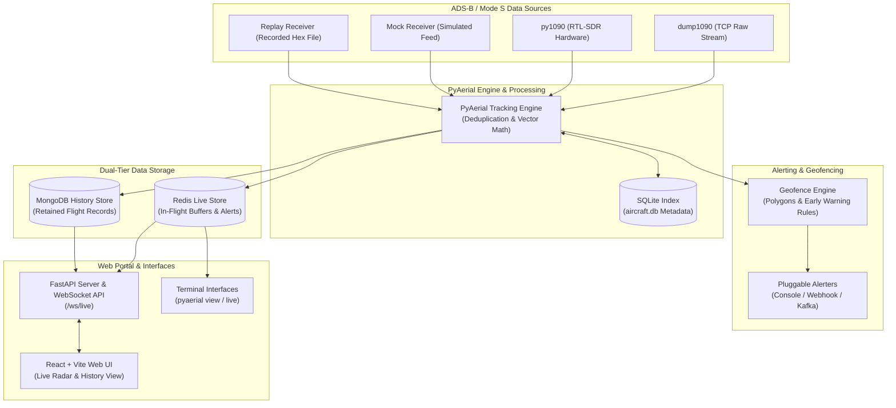

# PyAerial

_Scanning software for ADS-B / Mode S for AERPAW_

[](https://python.org)
[](https://opensource.org/licenses/MIT)
[](pyproject.toml)

**PyAerial** is a high-performance Python 3 application designed to receive ADS-B / Mode S aircraft telemetry signals, track flight positions in real time, evaluate dynamic polygon geofences with early-warning rules, trigger multi-channel alerts, stream live data to a web portal, and persist completed flights to a database.

---

## Architecture Overview



---

## Features

- Decodes position, altitude, horizontal/vertical velocity, direction, callsign, and ICAO plane categories in real time via [`pyModeS`](https://github.com/junzis/pymodes).
- Concurrently stream from TCP raw inputs (e.g. `dump1090`), direct hardware SDRs (`py1090` via `pyrtlsdr`), synthetic test feeds (`mock`), or a recorded dump1090 hex file (`replay`).
- Define custom polygon zones (inline coordinates, or a KML / KMZ / GeoJSON `file`) with rule constraints (`altitude`, `speed` / `horizontal_speed`, `heading` / `direction`, `distance`, `proximity`, `eta`) and lifecycle event hooks (`on_activate`, `on_deactivate`, `while_active`).
- Out-of-the-box support for console output (`print`), HTTP POST (`webhook`), and Apache Kafka message topics (`kafka`).
- Two storage methods:
  - Redis: live flight telemetry, active states, and real-time alert events (`live:flight:{id}`, `live:telemetry:{id}`, `live:alerts:{id}`, `live:active_alerts`, `live:alert_episodes`).
  - MongoDB: Persistent historical storage for important completed flights, track points, and alert episodes.
- ICAO metadata (model, operator, registration, photos) is cached in `aircraft.db` after lookups to HexDB / Planespotters; the file is a local cache, not a fully offline index.
- Webapp with real-time radar, flight tracking, alert feeds, and historical flight browse (track + telemetry table).
- Terminal interfaces including an interactive flight viewer (`pyaerial view`) and a live dump1090-style ASCII table display (`pyaerial live`).

---

## Quick Start

### Terminal mock feed

Try the tracker without an SDR dongle, Redis, or MongoDB:

```bash
# Clone and install dependencies
git clone https://github.com/quantumbagel/PyAerial.git
cd PyAerial
python3 -m venv .venv
source .venv/bin/activate
pip install -e .

# Simulated ADS-B approaches in the terminal
pyaerial live --mock
```

`view --mock` is the same isolated engine in an interactive REPL. Planes appear after a short warm-up while the tracker ingests the simulated feed. The web portal is **not** a mock mode — it reads Redis and MongoDB written by `pyaerial run`.

---

### Dockerized Setup

Run PyAerial with MongoDB, Redis, and the tracking engine + web portal:

```bash
# Start MongoDB, Redis, engine, and portal (no in-cluster dump1090)
docker compose up --build
```

Compose uses a bridge network and publishes only the web portal on port 10090. MongoDB and Redis are not exposed on the host and require the `MONGO_PASSWORD` / `REDIS_PASSWORD` env vars (default `pyaerial`).

The engine connects to dump1090 at `DUMP1090_HOST` (default `dump1090`, the optional compose service name). Without the SDR profile that host is not running, so either start dump1090 in-cluster or point at an existing receiver:

```bash
# USB SDR: also start dump1090 in the compose project
docker compose --profile sdr up --build

# No SDR: use dump1090 already listening on the host (port 30002)
DUMP1090_HOST=host.docker.internal docker compose up --build
```

A standalone `docker run` of the image still supervises dump1090 via `scripts/run-engine.sh`. Bind the portal on all interfaces with `pyaerial web --host 0.0.0.0` (the CLI default is `127.0.0.1`).

---

### No Docker Setup

1. Edit [`config.yaml`](config.yaml) with your ground station coordinates and database connection details.
2. Ensure MongoDB and Redis services are running locally or in Docker.
3. Start your ADS-B message feeder (e.g. `dump1090 --net --raw`).
4. Start the tracking engine:
   ```bash
   pyaerial run -c config.yaml
   ```
5. In another terminal, start the web portal (reads Redis / MongoDB; does not start tracking):
   ```bash
   pyaerial web -c config.yaml
   ```
   Build the React portal first if `src/pyaerial/static/` is missing: `scripts/build_web.sh`. Open **[http://localhost:10090](http://localhost:10090)**. If the map is empty, the portal will say whether the engine is down, Redis is unreachable, or there is simply no traffic.

---

## Installation

### Prerequisites

- Python: 3.11 or newer
- Node.js: 20+
- `dump1090` (recommended).

### Optional Extras

| Extra   | Dependencies        | Enabled Capabilities                             |
|---------|---------------------|--------------------------------------------------|
| `sdr`   | `pyrtlsdr`, `numpy` | Native `py1090` RTL-SDR hardware receiver plugin |
| `kafka` | `kafka-python-ng`   | Kafka alert publisher plugin                     |
| `dev`   | `pytest`, `httpx`   | Development tooling (optional test runner, HTTP client) |
| `all`   | all above           | Full feature set                                 |

To install all extras:

```bash
pip install -e ".[all]"
```

---

## CLI Reference

PyAerial provides a unified command line interface via the `pyaerial` executable:

| Subcommand          | Description                                                   |
|---------------------|---------------------------------------------------------------|
| `pyaerial run`      | Start the flight tracking engine (writes Redis / MongoDB)     |
| `pyaerial web`      | Start the web portal (reads Redis / MongoDB; does not track)  |
| `pyaerial validate` | Check configuration file syntax, schema, and cross-references |
| `pyaerial view`     | Interactive terminal flight viewer (`list`, `dump aircraft`, `status`, `live`) |
| `pyaerial live`     | Real-time ASCII terminal flight display                       |

The web portal exposes `GET /health`, `GET /ready`, `GET /api` (protocol discovery), and a WebSocket at `/ws/live` (alias `/ws`). Other apps can consume the same live stream and request history over that socket. Pass `?token=` when `web.token` / `PYAERIAL_WEB_TOKEN` is set.

### Usage Options

```bash
# Run tracking engine with a custom config
pyaerial run -c /path/to/config.yaml --aircraft-db /path/to/aircraft.db

# Validate configuration
pyaerial validate -c config.yaml

# Launch web portal on custom host and port (requires `pyaerial run` + Redis)
pyaerial web -c config.yaml --host 0.0.0.0 --port 10090

# Live flight viewer with 2-second refresh rate
pyaerial live --interval 2.0 [--mock]

# Print single-frame flight snapshot and exit
pyaerial live --once [--mock]

# Interactive flight search & detail view
pyaerial view [-c config.yaml] [--mock]

# Replay a recorded dump1090 capture (see examples/replay.yaml)
pyaerial run -c src/pyaerial/examples/replay.yaml
```

### Environment Variable Overrides

Environment variables override values in your `config.yaml`:

| Environment Variable | Overrides Config Key | Description                                         |
|----------------------|----------------------|-----------------------------------------------------|
| `PYAERIAL_CONFIG`    | Config path          | Default configuration file (`-c` still wins)        |
| `PYAERIAL_MONGODB`   | `database.uri`       | MongoDB connection URI                              |
| `PYAERIAL_REDIS`     | `database.redis_uri` | Redis connection URI                                |
| `PYAERIAL_LOG_LEVEL` | `logging.level`      | Logging level (`debug`, `info`, `warning`, `error`) |
| `PYAERIAL_LOG_FILE`  | `logging.file`       | Output log file path                                |
| `PYAERIAL_HZ`        | `tracking.hz`        | Engine loop tick rate (Hz)                          |
| `PYAERIAL_WEB_TOKEN` | `web.token`          | Optional shared secret for `/ws/live`               |
| `PYAERIAL_WEB_ORIGINS` | `web.origins`      | Comma-separated allowed WebSocket origins (`*` = any) |

String values in `config.yaml` also expand `${VAR}` and `${VAR:-default}`. A referenced variable with no default must be set, or `pyaerial validate` / load fails. Use this for webhook secrets:

```yaml
on_activate:
  - method: webhook
    options:
      url: "${PYAERIAL_WEBHOOK_URL}"
      format: discord
```

### WebSocket protocol

Connect to `ws://<host>:<port>/ws/live` (or `/ws`). Native clients (no `Origin` header) are accepted. Browser apps on another host need `web.origins: ["*"]` or an explicit origin list (the default is `*`). If `web.token` is set, pass it as `?token=` or the `x-pyaerial-token` header.

`GET /api` returns the same protocol document the socket sends on connect.

On connect the server sends `hello`, then a snapshot (`flights`, `alerts`, `stats`). After that it pushes those streams plus `telemetry` and `ping`.

Python example:

```python
import asyncio, json, websockets

async def main():
    async with websockets.connect("ws://127.0.0.1:10090/ws/live") as ws:
        hello = json.loads(await ws.recv())
        assert hello["type"] == "hello"
        await ws.send(json.dumps({
            "type": "request", "id": "1",
            "action": "subscribe",
            "params": {"streams": ["flights", "alerts"]},
        }))
        await ws.send(json.dumps({
            "type": "request", "id": "2",
            "action": "fetchFlights",
            "params": {"view": "live"},
        }))
        while True:
            msg = json.loads(await ws.recv())
            print(msg["type"], msg.get("id") or msg.get("stats") or "")

asyncio.run(main())
```

Client request:

```json
{ "type": "request", "id": "1", "action": "fetchFlights", "params": { "view": "live" } }
```

Server reply:

```json
{ "type": "response", "id": "1", "success": true, "data": [] }
```

| Action | Params | Notes |
|--------|--------|--------|
| `subscribe` | `streams` (`flights`, `alerts`, `telemetry`, `stats`) | Limit pushed streams for this connection. Omit / `[]` = all. |
| `fetchFlights` | `view` (`live` \| `history`); history: `skip`, `limit`, `q`, `since`, `until` | History `q` matches ICAO, callsign, or flight id. `since` / `until` are unix seconds on `end_time`. |
| `fetchFlight` | `flightId`, `view` | Single flight detail |
| `fetchTelemetry` | `flightId`, `view`, `since` | Track points after `since` |
| `fetchAlerts` | `view`; history: `skip`, `limit`, `q`, `since`, `until`, `flightId`, `rule` | History `q` matches ICAO, callsign, zone, rule, or flight id |
| `fetchStats` | — | Live / retained counts, `redis` / `mongo` booleans, `engine_seen_at` |
| `fetchZones` | — | Home, polygons, `alert_colors` |
| `fetchConfig` | — | Portal display config |

Pushed messages: `hello`, `flights`, `alerts`, `telemetry`, `stats`, `ping`.

---

## Configuration

Configuration is stored in YAML format. See [`config.yaml`](config.yaml) and [`src/pyaerial/examples/config.yaml`](src/pyaerial/examples/config.yaml).

### Section Breakdown

| Section        | Description                                                                                  |
|----------------|----------------------------------------------------------------------------------------------|
| `database`     | MongoDB URI, optional database name, and Redis URI                                           |
| `tracking`     | Tick rate, plane retention, live telemetry window, ETA options, status reporting             |
| `logging`      | Log level and optional file logging                                                          |
| `home`         | Receiver station latitude & longitude for ADS-B CPR decode (not the geofence)                |
| `receivers`    | Named receiver instances (`dump1090`, `py1090`, `mock`, `replay`)                            |
| `zones`        | Named polygons plus independent constraint rules (not an implicit inside-test)               |
| `alert_colors` | Hex colors keyed by **rule name**                                                            |
| `web`          | Optional `token` for `/ws/live`, and `origins` (default `*`) for cross-origin clients        |

### Configuration Example

```yaml
database:
  uri: mongodb://localhost:27017
  redis_uri: redis://localhost:6379/0
  # name: pyaerial   # Optional DB name (defaults to URI path or 'pyaerial')

tracking:
  hz: 2                           # Main loop frequency (Hz)
  remember_planes: 120            # Seconds to retain idle planes in RAM
  backdate_packets: 10            # Position history depth for velocity calculations
  duplicate_packet_merging: 5     # Seconds window to dedup duplicate hex frames
  status_message_top_planes: 5    # Top planes to show in console status lines
  advanced_status: true
  use_kalman_eta: false           # Use Kalman-smoothed velocity for ETA
  curved_projection: false        # Turn-rate-aware curved-path ETA projection
  telemetry_keep_seconds: 600     # How long live track points are kept in Redis

logging:
  level: info
  # file: /var/log/pyaerial.log

home:
  latitude: 35.727488
  longitude: -78.695942

alert_colors:
  warn: "#f59e0b"
  alert: "#ef4444"

# web:
#   token: "shared-secret"

receivers:
  main:
    type: dump1090
    host: localhost
    port: 30002
  sdr:
    type: py1090
    options:
      rtl_index: "0"
  # recorded:
  #   type: replay
  #   options:
  #     path: captures/adsb.raw   # lines of hex, or `timestamp hex`
  #     speed: 1.0
  #     loop: true

zones:
  airport_approach:
    color: "#f59e0b"
    coordinates:
      - [35.7288, -78.6954]
      - [35.7303, -78.6965]
      - [35.7304, -78.6992]
      - [35.7288, -78.6954]
    # file: zones/approach.geojson   # instead of coordinates; .kml / .kmz / .geojson
    rules:
      - name: low_altitude_warning
        color: "#ef4444"
        when:
          altitude: { max: 1000 }      # Altitude constraint (meters)
          eta: { max: 120 }             # Estimated arrival time constraint (seconds)
        dwell_seconds: 60              # Hold before activate (if hysteresis is 0) and before retain
        retain: true                   # If false, matching this rule never archives the flight
        hysteresis_seconds: 0          # If >0, overrides dwell as the activation hold; also the off-delay
        # predict_seconds: 20          # Also match against dead-reckoned future state
        on_activate:
          - method: print
          - method: webhook
            options:
              url: "https://example.com/alerts"
        on_deactivate:
          - method: print
        while_active:
          interval_seconds: 30
          actions:
            - method: print
```

### Rule Field Constraints

A zone is a named polygon plus independent rules. A rule fires when every `when` constraint holds — there is no implicit "inside the polygon" test. Include `eta`, `distance`, or `proximity` to tie a rule to the zone.

The `when` section supports numeric constraints (`min` / `max`) on telemetry and calculated metrics:

| Metric Field                         | Unit                    | Description                                              |
|--------------------------------------|-------------------------|----------------------------------------------------------|
| `altitude` / `alt`                   | Metres (`m`)            | Altitude (converted from feet)                           |
| `speed` / `horizontal_speed`         | km/h                    | Ground speed (ADS-B knots × 1.852, or geodesic)          |
| `vertical_speed` / `vert_speed`      | m/s                     | Rate of climb/descent (from ft/min)                      |
| `distance` / `dist`                  | km                      | Geodesic distance to the **zone polygon** edge           |
| `proximity`                          | m                       | Same as `distance`, in metres                            |
| `heading` / `direction`              | Degrees (`°`)           | Course; wrapping windows like `{min: 350, max: 10}` work |
| `eta`                                | Seconds (`s`)           | Time along the projected track to the zone boundary (`0` if already inside) |

Each rule also accepts:

| Field                 | Default | Description |
|-----------------------|---------|-------------|
| `dwell_seconds`       | required | Minimum seconds `when` must hold to activate (when hysteresis is 0) and to retain |
| `retain`              | `true`  | If `false`, matching this rule never archives the flight |
| `hysteresis_seconds`  | `0`     | If >0, activation hold (overrides dwell). Also the deactivation off-delay |
| `predict_seconds`     | unset   | Also evaluate `when` against a dead-reckoned position this many seconds ahead |

Zone polygons are `[latitude, longitude]` rings, or a `file` path relative to the config (`.kml`, `.kmz`, `.geojson` / `.json`). Provide `coordinates` or `file`, not both. GeoJSON/KML use lon,lat internally; PyAerial converts to lat,lon.

Replay receiver `options`: `path` (required), `speed` (default `1.0`), `loop` (default `true`), `interval` (seconds between untimestamped lines, default `0.1`). See [`src/pyaerial/examples/replay.yaml`](src/pyaerial/examples/replay.yaml).

---

## Data Model & Storage

### Redis (Live Telemetry & Active State)

Redis serves as an in-memory buffer while flights are active.
- `live:flights`: set of active flight ids
- `live:flight:{flight_id}`: current aircraft state JSON document
- `live:telemetry:{flight_id}`: sorted set of recent track points
- `live:alerts:{flight_id}`: alert episodes for that flight
- `live:active_alerts` / `live:alert_episodes`: global active set and episode index
- `live:engine`: tracking-engine heartbeat (`seen_at`); expires if `pyaerial run` stops

Data is automatically cleared or transitioned when a flight expires from memory.

### MongoDB (Historical Retention)

When a flight expires from the live store it is written to MongoDB only if **retain** says so:

1. A recorded alert episode whose rule has `retain: true` lasted at least `dwell_seconds`, or
2. Reconstructing the track against a `retain: true` rule shows at least `dwell_seconds` of matching samples.

A rule with `retain: false` never archives a flight on its own. Live Redis keys are still written for every active episode.

| Collection  | Purpose                                                                                                      |
|-------------|--------------------------------------------------------------------------------------------------------------|
| `flights`   | Retained flight summary documents (ICAO, callsign, start/end times, max speed, min altitude, alert flags)    |
| `telemetry` | Time-series track points linked by `flight_id`                                                               |
| `alerts`    | Recorded alert episodes detailing zone name, rule name, activation/deactivation times, and spatial telemetry |

Flight IDs follow the format: `{icao}-{first_packet_timestamp}` (e.g. `a1b2c3-1721832000`).

The historical portal view pages flights and alerts (50 at a time), searches ICAO / callsign / flight id on the server, and can filter by end date.

In `pyaerial view`, `dump aircraft <icao>` prints the HexDB / Planespotters cache record (`dump opensky` remains an alias).

## License

This project is licensed under the **MIT License**. See [LICENSE](LICENSE) for details.

© 2024–2026 **Julian Reder** ([@quantumbagel](https://github.com/quantumbagel)).
