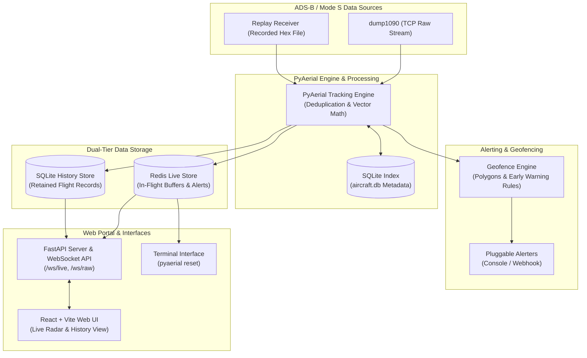

# PyAerial

_Scanning software for ADS-B / Mode S for AERPAW_

[](https://python.org)
[](https://www.gnu.org/licenses/gpl-3.0)
[](pyproject.toml)

PyAerial decodes ADS-B / Mode S frames, tracks aircraft, evaluates polygon zone rules, fires alerts, streams live state over WebSocket, and archives retained flights to SQLite.

**Architecture**



**Behavior**

- Decodes position, altitude, horizontal and vertical velocity, direction, callsign, and ICAO category via [`pyModeS`](https://github.com/junzis/pymodes).
- Can read dump1090 over TCP and a recorded hex file (`replay`) at the same time. USB SDR input is dump1090 (`docker compose --profile sdr`), not an in-process decoder.
- Zones are named polygons (inline coordinates, or a KML / KMZ / GeoJSON `file`) with independent `when` rules on `altitude`, `speed` / `horizontal_speed`, `heading` / `direction`, `distance`, `proximity`, and `eta`. Lifecycle hooks are `on_activate`, `on_deactivate`, and `while_active`.
- Alerters include console `print` and HTTP POST (`webhook`).
- Redis holds live telemetry and active alerts (`live:flight:{id}`, `live:telemetry:{id}`, `live:alerts:{id}`, `live:active_alerts`, `live:alert_episodes`). SQLite at `database.path` (default `pyaerial.db`) stores retained completed flights, track points, and alert episodes.
- ICAO metadata (model, operator, registration, photos) is cached in `aircraft.db` after HexDB / Planespotters lookups. That file is a local cache, not a fully offline index. It stays in SQLite so restarts do not hit those APIs again.
- The web portal shows a live radar, an alert feed, a raw frame stream, and historical flight browse with a track and telemetry table.
- The terminal tool is `pyaerial reset` (wipe retained history).

**Docker**

```bash
docker compose up --build
```

Compose uses a bridge network and publishes the portal on port `10090`. Redis is not bound on the host and requires `REDIS_PASSWORD` (default `pyaerial`). Engine and web share `/data/pyaerial.db` on the `pyaerial_data` volume.

The engine connects to dump1090 at `DUMP1090_HOST` (default `dump1090`, the optional compose service). Without the SDR profile that host is not running:

```bash
# USB SDR: start dump1090 in the compose project
docker compose --profile sdr up --build

# Existing dump1090 on the host (port 30002)
DUMP1090_HOST=host.docker.internal docker compose up --build
```

A standalone `docker run` of the image still supervises dump1090 via `scripts/run-engine.sh`. Bind the portal on all interfaces with `pyaerial web --host 0.0.0.0` (the CLI default is `127.0.0.1`).

**Without Docker**

1. Set `home` and storage paths in [`config.yaml`](config.yaml).
2. Start Redis. SQLite history is a local file (`database.path`); no extra database daemon is required.
3. Start a feeder, for example `dump1090 --net --raw`.
4. Start the tracking engine: `pyaerial run -c config.yaml`
5. Start the portal: `pyaerial web -c config.yaml`. It reads Redis and SQLite and does not track. If `src/pyaerial/static/` is missing, build it first with `scripts/build_web.sh`. Open [http://localhost:10090](http://localhost:10090). If the map is empty, the portal reports whether the engine is down, Redis is unreachable, or there is simply no traffic.

**Install**

Requires Python 3.11 or newer and Node.js 20+. `dump1090` is recommended.

```bash
pip install -e ".[dev]"
```

**Docs**

| Document | Contents |
|----------|----------|
| [CONFIGURATION.md](CONFIGURATION.md) | YAML schema, zone rules, Redis and SQLite |
| [CLI.md](CLI.md) | Commands, environment variables, WebSocket protocol |
| [UNITS.md](UNITS.md) | Stored units for telemetry and rule fields |

| Subcommand | Role |
|------------|------|
| `pyaerial run` | Tracking engine (writes Redis and SQLite) |
| `pyaerial web` | Portal (reads Redis and SQLite; does not track) |
| `pyaerial validate` | Config syntax, schema, and cross-references |
| `pyaerial reset` | Wipe retained history (`--yes`; live Redis only if the engine is stopped) |

Flags, environment variables, and the `/ws/live` protocol are documented in [CLI.md](CLI.md).

This project is free software under GPL-3.0-or-later. Full terms are in [LICENSE](LICENSE).
