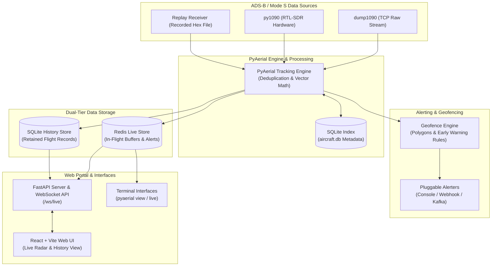

# PyAerial

_Scanning software for ADS-B / Mode S for AERPAW_

[](https://python.org)
[](https://www.gnu.org/licenses/gpl-3.0)
[](pyproject.toml)

**PyAerial** is a high-performance Python 3 application designed to receive ADS-B / Mode S aircraft telemetry signals, track flight positions in real time, evaluate dynamic polygon geofences with early-warning rules, trigger multi-channel alerts, stream live data to a web portal, and persist completed flights to a database.

---

## Architecture Overview



---

## Features

- Decodes position, altitude, horizontal/vertical velocity, direction, callsign, and ICAO plane categories in real time via [`pyModeS`](https://github.com/junzis/pymodes).
- Concurrently stream from TCP raw inputs (e.g. `dump1090`), direct hardware SDRs (`py1090` via `pyrtlsdr`), or a recorded dump1090 hex file (`replay`).
- Define custom polygon zones (inline coordinates, or a KML / KMZ / GeoJSON `file`) with rule constraints (`altitude`, `speed` / `horizontal_speed`, `heading` / `direction`, `distance`, `proximity`, `eta`) and lifecycle event hooks (`on_activate`, `on_deactivate`, `while_active`).
- Out-of-the-box support for console output (`print`), HTTP POST (`webhook`), and Apache Kafka message topics (`kafka`).
- Two storage methods:
  - Redis: live flight telemetry, active states, and real-time alert events (`live:flight:{id}`, `live:telemetry:{id}`, `live:alerts:{id}`, `live:active_alerts`, `live:alert_episodes`).
  - SQLite: persistent historical storage for retained completed flights, track points, and alert episodes (`database.path`, default `pyaerial.db`).
- ICAO metadata (model, operator, registration, photos) is cached in `aircraft.db` after lookups to HexDB / Planespotters; the file is a local cache, not a fully offline index. It stays in SQLite rather than Redis so lookups survive restarts without hitting those APIs again.
- Webapp with real-time radar, flight tracking, alert feeds, and historical flight browse (track + telemetry table).
- Terminal interfaces including an interactive flight viewer (`pyaerial view`) and a live dump1090-style ASCII table display (`pyaerial live`).

---

## Quick Start

### Dockerized Setup

Run PyAerial with Redis, a shared SQLite archive volume, and the tracking engine + web portal:

```bash
# Start Redis, engine, and portal (no in-cluster dump1090)
docker compose up --build
```

Compose uses a bridge network and publishes only the web portal on port 10090. Redis is not exposed on the host and requires the `REDIS_PASSWORD` env var (default `pyaerial`). Engine and web share `/data/pyaerial.db` on the `pyaerial_data` volume.

The engine connects to dump1090 at `DUMP1090_HOST` (default `dump1090`, the optional compose service name). Without the SDR profile that host is not running, so either start dump1090 in-cluster or point at an existing receiver:

```bash
# USB SDR: also start dump1090 in the compose project
docker compose --profile sdr up --build

# No SDR: use dump1090 already listening on the host (port 30002)
DUMP1090_HOST=host.docker.internal docker compose up --build
```

A standalone `docker run` of the image still supervises dump1090 via `scripts/run-engine.sh`. Bind the portal on all interfaces with `pyaerial web --host 0.0.0.0` (the CLI default is `127.0.0.1`).

---

### No Docker Setup

1. Edit [`config.yaml`](config.yaml) with your ground station coordinates and storage paths.
2. Ensure Redis is running locally or in Docker. SQLite history is a local file (`database.path`); no extra database daemon is required.
3. Start your ADS-B message feeder (e.g. `dump1090 --net --raw`).
4. Start the tracking engine:
   ```bash
   pyaerial run -c config.yaml
   ```
5. In another terminal, start the web portal (reads Redis / SQLite; does not start tracking):
   ```bash
   pyaerial web -c config.yaml
   ```
   Build the React portal first if `src/pyaerial/static/` is missing: `scripts/build_web.sh`. Open **[http://localhost:10090](http://localhost:10090)**. If the map is empty, the portal will say whether the engine is down, Redis is unreachable, or there is simply no traffic.

---

## Installation

### Prerequisites

- Python: 3.11 or newer
- Node.js: 20+
- `dump1090` (recommended).

### Optional Extras

| Extra   | Dependencies        | Enabled Capabilities                             |
|---------|---------------------|--------------------------------------------------|
| `sdr`   | `pyrtlsdr`, `numpy` | Native `py1090` RTL-SDR hardware receiver plugin |
| `kafka` | `kafka-python-ng`   | Kafka alert publisher plugin                     |
| `dev`   | `pytest`, `httpx`   | Development tooling (optional test runner, HTTP client) |
| `all`   | all above           | Full feature set                                 |

To install all extras:

```bash
pip install -e ".[all]"
```

---

## Documentation

| Document | Contents |
|----------|----------|
| [CONFIGURATION.md](CONFIGURATION.md) | YAML schema, geofence rules, Redis / SQLite storage |
| [CLI.md](CLI.md) | Commands, environment variables, WebSocket protocol |
| [UNITS.md](UNITS.md) | Stored units for telemetry and rule fields |

PyAerial provides a unified command line interface via the `pyaerial` executable:

| Subcommand          | Description                                                   |
|---------------------|---------------------------------------------------------------|
| `pyaerial run`      | Start the flight tracking engine (writes Redis / SQLite)      |
| `pyaerial web`      | Start the web portal (reads Redis / SQLite; does not track)   |
| `pyaerial validate` | Check configuration file syntax, schema, and cross-references |
| `pyaerial view`     | Interactive terminal flight viewer (`list`, `dump aircraft`, `status`, `live`) |
| `pyaerial live`     | Real-time ASCII terminal flight display                       |

See [CLI.md](CLI.md) for usage examples, environment variable overrides, and the `/ws/live` protocol.

---

## License

This project is free software under the **GNU General Public License v3.0 or later**. See [LICENSE](LICENSE) for the full terms.
