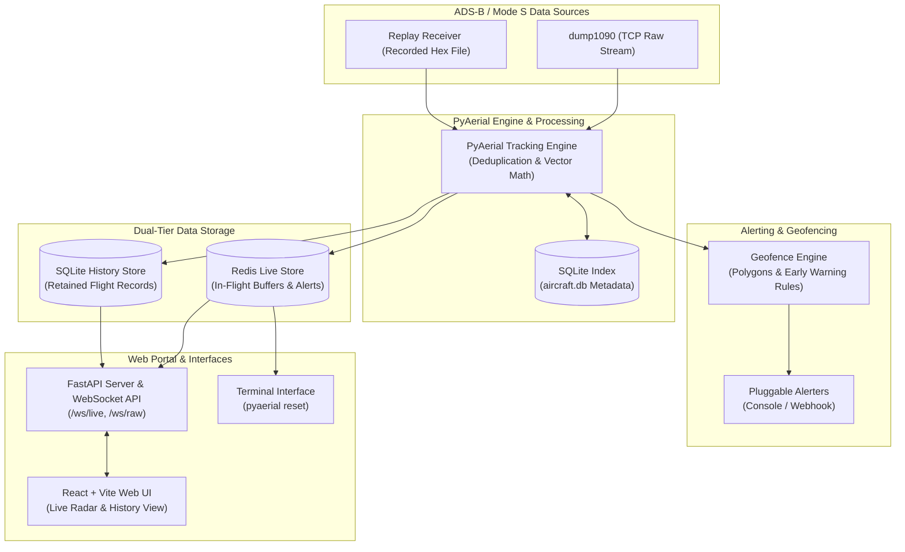

# PyAerial

[](https://python.org)
[](https://www.gnu.org/licenses/gpl-3.0)
[](pyproject.toml)

PyAerial decodes Mode S / ADS-B transponder messages, computes real-time aircraft kinematics, evaluates polygon geofence rules, broadcasts live state over WebSockets, and archives matching flights into SQLite.

**Architecture**



**System capabilities**

- Ingests raw frames from dump1090 TCP sockets (AVR or Beast binary) and recorded capture files simultaneously, delegating radio DSP decoding to external daemons.
- Decodes position, altitude, ground speed, vertical velocity, heading, callsign, and aircraft category via [`pyModeS`](https://github.com/junzis/pymodes).
- Evaluates polygon geofences from inline coordinates or `.kml`, `.kmz`, and `.geojson` geometries against altitude, speed, distance, and projected track ETA.
- Dispatches alert notifications to console logs and authenticated Discord, Slack, or generic JSON webhooks across activation, steady-state, and deactivation lifecycles.
- Maintains active flight buffers and alert episodes in Redis, while committing qualifying flights and high-resolution tracks to SQLite using Write-Ahead Logging.
- Caches airframe details, registrations, and photo links in a local `aircraft.db` SQLite file through HexDB and Planespotters APIs.
- Serves interactive Leaflet radar views, alert streams, raw frame diagnostics, and historical telemetry tables from an integrated FastAPI portal.

**Docker deployment**

```bash
docker compose up --build
```

Compose launches a private bridge network and binds the web portal to port `10090`. Redis requires authentication via `REDIS_PASSWORD` (default `pyaerial`) and remains unexposed to host interfaces, while the engine and web services share database state on the `pyaerial_data` volume (`/data/pyaerial.db`).

The engine connects to dump1090 via `DUMP1090_HOST` (defaulting to the internal `dump1090` compose service container), which can be redirected to host hardware or external network feeders:

```bash
# Ingest from physical USB SDR via compose service
docker compose --profile sdr up --build

# Ingest from existing dump1090 daemon listening on host port 30002
DUMP1090_HOST=host.docker.internal docker compose up --build
```

The portal binds `127.0.0.1` by default in local CLI environments; pass `--host 0.0.0.0` when containerizing or exposing to network interfaces.

**Host deployment**

1. Define `home` coordinates and storage targets in [`config.yaml`](config.yaml).
2. Start a Redis server instance (`redis-server`).
3. Start the ADS-B feeder (e.g. `dump1090 --net --raw`).
4. Launch the tracking engine: `pyaerial run -c config.yaml`
5. Launch the web portal: `pyaerial web -c config.yaml --port 10090`. The portal is strictly read-only and reads state from Redis and SQLite without running tracking pipelines. If static assets are missing, build them via `scripts/build_web.sh`.
6. Navigate to `http://localhost:10090`. The portal header displays discrete indicators when the engine heartbeat is lost, Redis is unreachable, or receiver feeds are quiet.

**Installation**

Requires Python 3.11+ and Node.js 20+. `dump1090` is required for live radio reception.

```bash
pip install -e ".[dev]"
```

**Reference documentation**

| Document | Focus |
|----------|-------|
| [CONFIGURATION.md](CONFIGURATION.md) | YAML schema, spatial rule syntax, Redis schema, and SQLite tables |
| [CLI.md](CLI.md) | Subcommands, environment variable overrides, and service execution |
| [WEBSOCKET.md](WEBSOCKET.md) | Wire protocol, stream subscriptions, RPC action schemas, and client examples |
| [UNITS.md](UNITS.md) | SI base units, conversion formulas, and sensor timestamp standards |

**Command-line interfaces**

| Command | Process role |
|---------|--------------|
| `pyaerial run` | Tracking engine (ingests frames, writes Redis live state and SQLite history) |
| `pyaerial web` | Web portal and API server (reads Redis and SQLite; does not track) |
| `pyaerial validate` | Syntax, schema, and filesystem cross-reference verification |
| `pyaerial reset` | Retention purger (`--yes`; clears Redis only when engine is stopped) |

Licensed under GPL-3.0-or-later. See [LICENSE](LICENSE).
